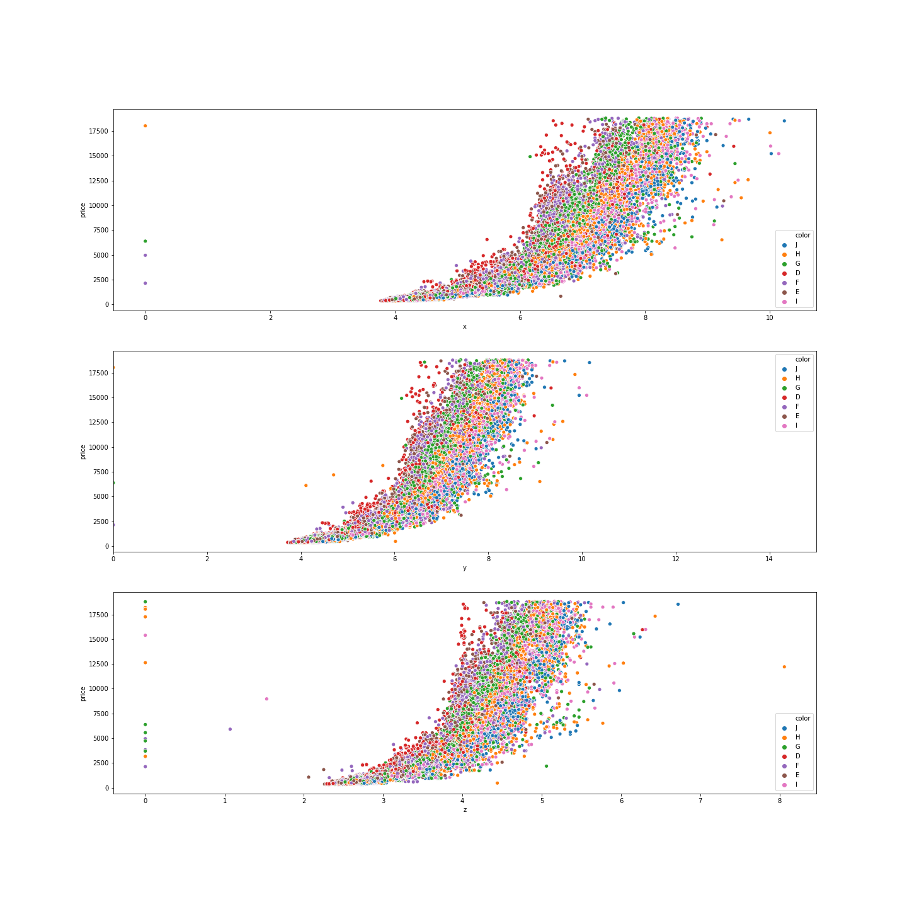
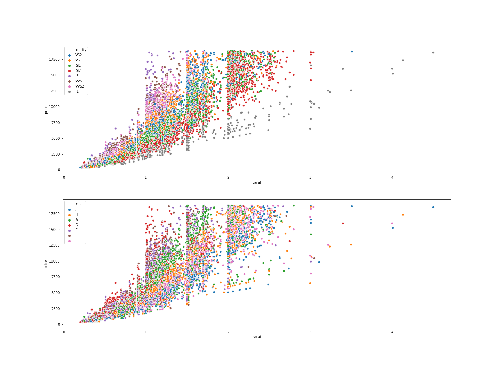

# Data Visualization Project

The goal of this project is to perform an exploratory analysis of how diamonds prices vary depending on several variables.

### Price by Size and Color

The first variables studied are how the price change due to size and color. It is observed that the D color are more expensive with smaller diamond size while H and I need a larger diamonf to reach the same price D color have a exponential price increase with size while I and H have logarithmic.

  

### Price by carat

It is observed that the diamonds with clarity IF are the most expensive with lower carat.
It is also observed that diamonds of color D are the most expensive at lower carat.

### Conclusion

The diamonds of color D and clarity IF are the most expensive. Their prices grow exponentially with carat and size.

However, this diamonds are also the most strange ones because when we compare the mean prices their mean price is one of the lowest. Therefore, this kind of diamonds are really expensive but it is extremelly weird to find huge and clear diamonds of this type.

The cheapest diamonds are diamonds with SI2 clarity and J color. Their price grow linearly. However, when we check the mean price of these diamonds it is observed that they are the highest one, thus is due to the fact that this diamonds are commonly found in huge shapes and clearness.

### LINK to TABLEAU PUBLIC

If you want more information about the diamonds dataset exploratory analysis you can check my tableau public acount!
https://public.tableau.com/profile/diego4867#!/vizhome/Diamonds_15960466989090/Dashboard1
